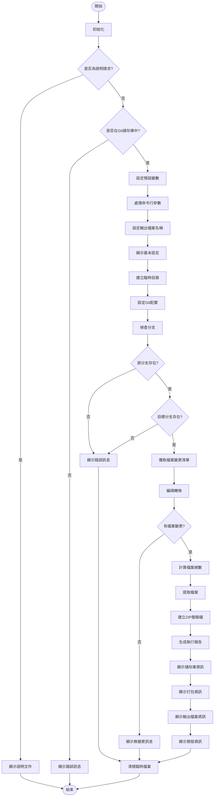

# Git 變更檔案打包工具 - 流程圖

## 流程說明

### 1. 初始化階段
- 檢查是否為說明請求 (`--help` 或 `/?`)
- 驗證是否在 Git 儲存庫中執行
- 設定預設變數 (輸出檔名、源分支、目標分支)
- 處理位置參數或具名參數 (`-F`, `-S`, `-T`)

### 2. 準備階段
- 在系統臨時目錄中建立工作資料夾
- 設定 Git 配置以正確處理中文路徑

### 3. 分支檢查階段
- 檢查源分支是否存在
- 檢查目標分支是否存在

### 4. 檔案分析階段
- 使用 `git diff-tree` 獲取檔案變更清單
- 進行編碼轉換 (UTF-8 → BIG5)
- 檢查是否有檔案變更

### 5. 檔案處理階段
- 計算變更檔案總數
- 按照原始目錄結構提取檔案
- 顯示處理進度

### 6. 壓縮打包階段
- 使用 PowerShell 將檔案打包成 ZIP 格式

### 7. 報告生成階段
- 顯示儲存庫資訊 (路徑、分支、提交)
- 顯示打包資訊 (源分支、目標分支、檔案數量)
- 顯示輸出檔案資訊 (路徑、大小、時間)
- 顯示開發及使用說明資訊

### 8. 清理階段
- 刪除臨時檔案和目錄

## 決策節點

1. **是否為說明請求** - 決定是顯示說明還是執行操作
2. **是否在 Git 儲存庫中** - 確保在正確環境執行
3. **分支是否存在** - 驗證源分支和目標分支的有效性
4. **是否有檔案變更** - 決定是否繼續打包流程

此流程圖清楚呈現了工具的運行邏輯及主要處理步驟，有助於理解工具的工作原理。
